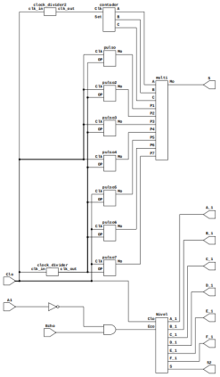

# Proyecto DIGITAL1-2023-2 
En este repositorio se explicará el método utilizado para la implementación de un radar activado por el sensor infrarrojo FC-51, detectando proximidad por el sensor ultrasonico Hc-sr04 y teniendo un movimiento dinamico dado por un servomotor. La mayoria de programación de modulos se realizó en verilog y Digital.


El esquema general del circuito radar realizado se muestra en la siguiente figura:



Een el esquema anterior se nota que el sensor infrarrojo controla la activación de la señal en el sensor ultrasonico.

En el esquema se observan los modulos "pulsoN" (donde N es un número del 1 al 7), los cuales definen el ángulo de movimiento del servomotor para que se mueva en varios grados de libertad.


A su vez este modulo compara una señal con una referencia diseñada para cada caso, por ejemplo para el "pulso4" se tiene el siguiente esquema:


Para observar cualuier modulo de interes se utiliza el siguiente código en la carpeta [CodigoP.zip](./CodigoP.zip) descargada (será necesario tener los modulos especificados en este repositorio; [RP](https://github.com/johnnycubides/digital-electronic-1-101/tree/main))

```bash
make rtl TOP=moodulo_de_interes
```

Para realizar simulaciones en gtkwave se utiliza el siguiente comando:


```bash
make sim
```
AL realizar simulaciones se observan lo mostrado en la siguiente figura:


En el siguiente video corto se observa la implementación del proyecto y un analisis de los modulos principales que conforman el mismo.

[](https://www.youtube.com "Implementación proyecto radar 28-11-2023")


