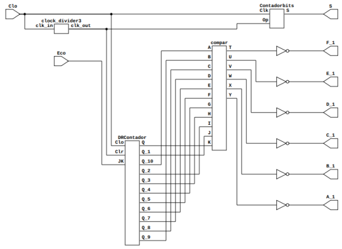

# Proyecto DIGITA1-2023-2 
En este repositorio se explicará el método utilizado para la implementación de un radar activado por el sensor infrarrojo FC-51, detectando proximidad por el sensor ultrasonico Hc-sr04 y teniendo un movimiento dinamico dado por un servomotor. La mayoria de programación de modulos se realizó en verilog y Digital.

El esquema general del circuito radar realizado se muestra en la siguiente figura:

